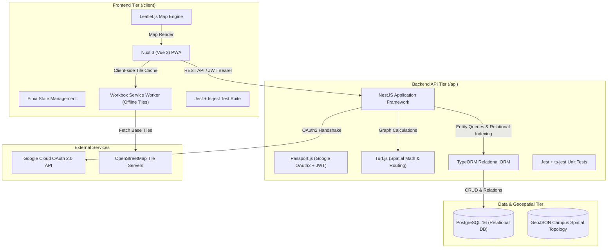
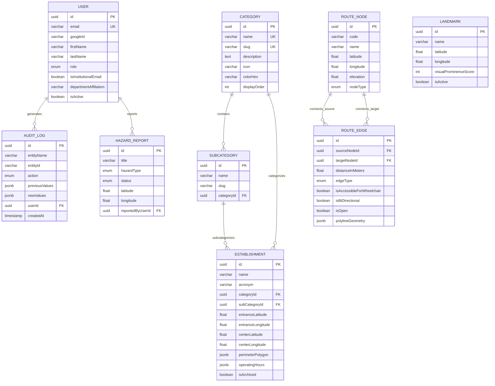

# MSU Lalan - Developer's Guide & System Architecture
**Mindanao State University Main Campus Geospatial Navigation and Directory System**

---

## 1. Executive Summary & Architectural Overview

**MSU Lalan** is a Progressive Web Application (PWA) and geospatial navigation platform engineered specifically for the Mindanao State University (MSU) Main Campus in Marawi City.

The system addresses campus wayfinding challenges through landmark-guided navigation, an offline-resilient map tile cache, an administrative Content Management System (CMS), and Role-Based Access Control (RBAC) integrated with Google OAuth 2.0.

### 1.1 High-Level Architecture Diagram



---

## 2. Monorepo Structure

The project is organized as an npm monorepo with two primary workspaces:

```
msu-lalan/
├── .github/
│   └── workflows/
│       └── ci.yml               # GitHub Actions CI pipeline (Tests & Builds)
├── api/                         # Backend Workspace (NestJS + TypeORM)
│   ├── src/
│   │   ├── config/              # TypeORM & Environment configurations
│   │   ├── data/geojson/        # Campus spatial network GeoJSON surveys
│   │   ├── modules/
│   │   │   ├── admin/           # Audit logs & administrative features
│   │   │   ├── auth/            # Google OAuth2, JWT, Guards, RBAC
│   │   │   ├── database/        # TypeORM database module
│   │   │   ├── directory/       # Categories, Subcategories, Establishments
│   │   │   ├── navigation/      # Landmarks, RouteNodes, RouteEdges, Hazards
│   │   │   └── users/           # User entities and management
│   │   ├── app.module.ts        # Root NestJS module
│   │   └── main.ts              # Application bootstrap & Swagger OpenAPI
│   ├── jest.config.ts           # Jest TypeScript testing config
│   ├── tsconfig.json            # TypeScript compiler configuration
│   ├── Dockerfile               # Backend Docker containerfile
│   └── .env.example             # API environment variables template
├── client/                      # Frontend Workspace (Nuxt 3 + PWA + Leaflet)
│   ├── layouts/                 # Nuxt UI layouts (Default, Admin)
│   ├── pages/                   # Application routes (Map, Directory, Auth)
│   ├── plugins/                 # Nuxt plugins (Leaflet client-only wrapper)
│   ├── stores/                  # Pinia state stores (Auth, Map)
│   ├── types/                   # Frontend TypeScript interfaces
│   ├── test/                    # Frontend Jest unit test suites
│   ├── nuxt.config.ts           # Nuxt 3 & PWA workbox caching config
│   ├── tailwind.config.ts       # Tailwind CSS theme with MSU palette
│   ├── jest.config.ts           # Jest TypeScript & Vue3-Jest config
│   ├── Dockerfile               # Frontend Docker containerfile
│   └── .env.example             # Client environment variables template
├── docker-compose.yml           # Multi-container local development stack
├── package.json                 # Monorepo workspaces definition & scripts
└── DEVELOPERS_GUIDE.md          # System architecture and developer handbook
```

---

## 3. Team Resource Allocation (7-Developer Stewardship Model)

Each member of the 7-developer engineering team serves as the dedicated steward for a specific end-to-end feature slice:

| Developer | Technical Stewardship | End-to-End Feature Slice | Core Responsibilities |
| :--- | :--- | :--- | :--- |
| **Developer 1** | Backend Scaffolding & DevOps | **Auth & RBAC (Google OAuth2 + JWT)** | Setup Google OAuth2, JWT session tokens, `@msumain.edu.ph` institutional verification, CI/CD pipelines, Docker containerization. |
| **Developer 2** | Frontend Core & PWA Architecture | **Directory & Establishment Details View** | Nuxt 3 PWA configuration, offline caching strategies, directory listing UI, hierarchical taxonomy views. |
| **Developer 3** | GIS & Map Engine Core | **Interactive Map Shell & User GPS Tracking** | Leaflet.js canvas integration, base map tiles, device GPS geolocation, manual pin-drop fallback. |
| **Developer 4** | Spatial Routing & Pathfinding Engine | **Navigation Module & Polyline Rendering** | Dijkstra / A* pedestrian pathfinding engine, turn-by-turn instruction generator, route polyline rendering with visual landmark anchors. |
| **Developer 5** | Search & Data Indexing | **Global Search, Multi-Filter & Proximity Engine** | Coordinate-indexed spatial queries, fuzzy text search (Name, Acronym, Category), radius/proximity sorting. |
| **Developer 6** | CMS & Form Framework | **Establishment & Category Admin Management** | Administrative CMS dashboard, establishment CRUD forms, soft-delete archiving, audit log tracking. |
| **Developer 7** | QA Automation & Ground-Truthing | **Coordinate Pin-Drop Tool & Hazard Reporting** | Coordinate calibration utilities, campus walk-through ground truth validation, pathway closure/hazard reporting module, unit/E2E testing. |

---

## 4. Agile Project Roadmap

### Sprint 0: Inception & Foundations (Weeks 1-2) — *[Current]*
- [x] Initial repository scaffolding and CI/CD setup.
- [x] GeoJSON survey of the MSU campus spatial network baseline.
- [x] Definition of the PostgreSQL relational schema with TypeORM entities.
- [x] Google OAuth 2.0 authentication project configuration & JWT guards.
- [x] Jest TypeScript unit test setup across both workspaces.

### Sprint 1: Auth, Directory & Base Map (Weeks 3-4)
- Integration of Google OAuth2 and JWT strategies in frontend client.
- Deployment of the Nuxt 3 Leaflet canvas with base tiles and landmark markers.
- Development of establishment listing, categorization, and text search endpoints.

### Sprint 2: Pathfinding & Administration (Weeks 5-6)
- Implementation of the pedestrian route solver (Dijkstra / A* using `RouteNode` & `RouteEdge` graph).
- Polyline visual navigation rendering on the Leaflet canvas.
- Development of the Admin CMS for category and place management.
- Integration of offline PWA cache for map tiles and establishment directory.

### Sprint 3: Field Verification, UAT & Launch (Weeks 7-8)
- On-ground campus walk-through for coordinate calibration.
- Comprehensive security audit, penetration testing, and RBAC validation.
- User Acceptance Testing (UAT) with MSU students, faculty, and visitors.
- Final containerized deployment and handover.

---

## 5. PostgreSQL Relational & Spatial Schema (TypeORM)

### 5.1 Entity-Relationship Overview



---

## 6. Google OAuth 2.0 & Role-Based Access Control (RBAC)

### 6.1 Google Cloud Console Setup Instructions
1. Navigate to the [Google Cloud Console](https://console.cloud.google.com/).
2. Create a new project: **MSU Lalan Wayfinding**.
3. Go to **APIs & Services > OAuth consent screen**:
   - User Type: **External** (or Internal if under Google Workspace for Education).
   - Scopes: `.../auth/userinfo.email`, `.../auth/userinfo.profile`, `openid`.
4. Go to **APIs & Services > Credentials**:
   - Create **OAuth 2.0 Client IDs** (Application type: *Web application*).
   - Authorized JavaScript origins:
     - `http://localhost:3000` (Nuxt frontend)
     - `http://localhost:3001` (NestJS backend)
   - Authorized redirect URIs:
     - `http://localhost:3001/api/v1/auth/google/callback`
5. Copy `Client ID` and `Client Secret` into `/api/.env`.

### 6.2 Institutional Email Domain Filtering
The `AuthService` validates the user's Google email against the institutional domain (`ALLOWED_DOMAIN=msumain.edu.ph`):
- Users authenticated via `@msumain.edu.ph` are flagged with `isInstitutionalEmail: true`.
- Elevated roles (`CAMPUS_ADMIN`, `SUPER_ADMIN`) can be assigned to verified department encoders and administrators.
- General users (guests, non-institutional emails) have read-only navigation and directory search privileges.

---

## 7. Getting Started & Local Development

### 7.1 Prerequisites
- **Node.js**: v22.x LTS
- **Docker & Docker Compose**: Optional for containerized database execution
- **PostgreSQL**: 16.x (if running natively without Docker)

### 7.2 Installation & Setup

1. **Install Monorepo Dependencies**:
   ```bash
   npm install
   ```

2. **Configure Environment Files**:
   - Copy backend environment template:
     ```bash
     cp api/.env.example api/.env
     ```
   - Copy frontend environment template:
     ```bash
     cp client/.env.example client/.env
     ```

3. **Start PostgreSQL via Docker**:
   ```bash
   npm run docker:up
   ```

4. **Run Development Servers**:
   - Start both backend and frontend concurrently:
     ```bash
     npm run dev
     ```
   - Or start individually:
     ```bash
     npm run dev:api     # Backend API on http://localhost:3001
     npm run dev:client  # Frontend PWA on http://localhost:3000
     ```

5. **Access Endpoints**:
   - **Frontend Map & Directory**: `http://localhost:3000`
   - **Backend API**: `http://localhost:3001/api/v1`
   - **Swagger OpenAPI Documentation**: `http://localhost:3001/docs`

---

## 8. Testing Guide (Jest + TypeScript)

Both `/api` and `/client` workspaces are equipped with Jest and `ts-jest` for TypeScript test execution.

### 8.1 Running Unit Tests
- **Run all unit tests across the monorepo**:
  ```bash
  npm run test
  ```
- **Run backend unit tests only**:
  ```bash
  npm run test:api
  ```
- **Run frontend unit tests only**:
  ```bash
  npm run test:client
  ```
- **Run in watch mode during active development**:
  ```bash
  npm run test:api:watch
  npm run test:client:watch
  ```

---

## 9. CI/CD Pipeline

The `.github/workflows/ci.yml` pipeline automates continuous integration on pull requests and pushes to `main` and `develop`:
1. Launches isolated PostgreSQL 16 container service.
2. Installs monorepo dependencies (`npm ci`).
3. Executes TypeScript compilation and build checks for both `/api` and `/client`.
4. Runs backend and frontend Jest unit test suites with coverage tracking.
